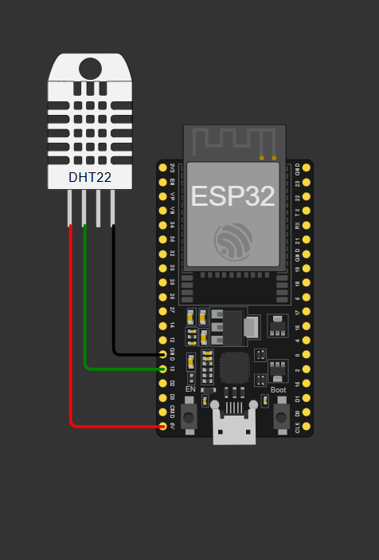
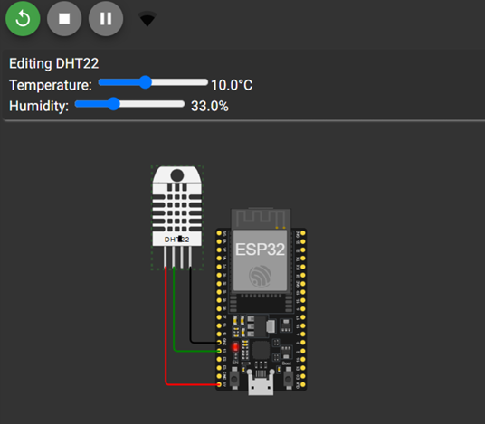
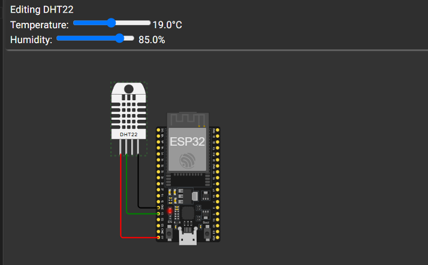
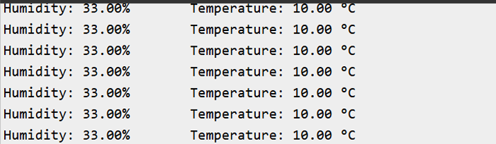
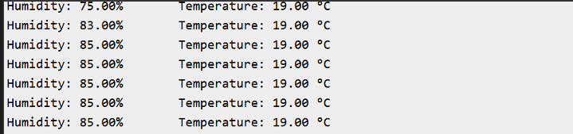
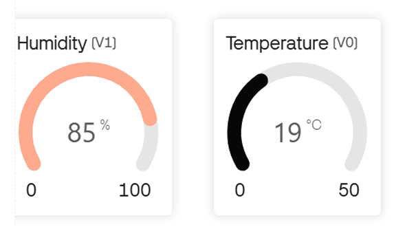
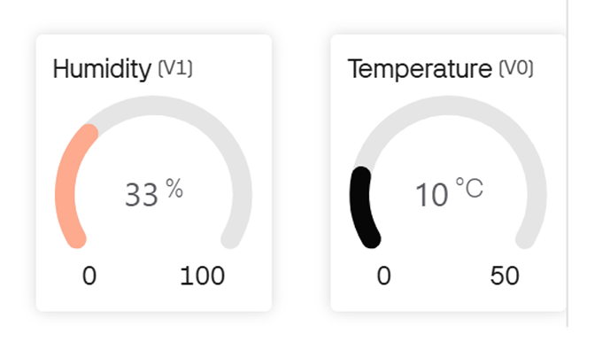

# IoT Based Weather Data System using ESP32

## Overview
In this project, I developed an IoT-based weather monitoring system using the ESP32 microcontroller and a DHT22 sensor. The system measures environmental parameters such as temperature and humidity and uploads the data to the Blynk IoT platform for real-time visualization and monitoring.

## Features
- Real-time temperature monitoring
- Real-time humidity monitoring
- Wi-Fi based data transmission
- Cloud visualization using Blynk dashboard
- Serial monitor output for debugging

## Components Used
- ESP32 Development Board
- DHT22 Temperature and Humidity Sensor
- Breadboard
- Jumper Wires
- Wi-Fi connectivity
- Blynk IoT platform

## Working Principle
The DHT22 sensor measures temperature and humidity from the surrounding environment. The ESP32 reads these values and sends them to the Blynk IoT platform through Wi-Fi. The collected data is displayed on the Blynk dashboard using virtual pins V0 and V1, allowing users to monitor weather conditions remotely.

## Circuit Diagram

## Wokwi Simulation

## Serial Monitor Output

## Blynk Dashboard Output

Temperature and humidity values displayed on the cloud dashboard.

## Tools Used
- Arduino IDE
- Wokwi Simulator
- Blynk IoT Platform
- GitHub

## Applications
- Smart weather monitoring
- IoT environmental monitoring
- Smart agriculture systems
- Remote climate monitoring

## Future Improvements
- Add pressure and air quality sensors
- Store weather data in cloud databases
- Build a mobile notification system
- Deploy multiple sensor nodes

## Conclusion
This project demonstrates how IoT technology can be used to collect and monitor environmental data remotely. The ESP32 and DHT22 sensor provide an efficient and low-cost solution for building real-time weather monitoring systems.
